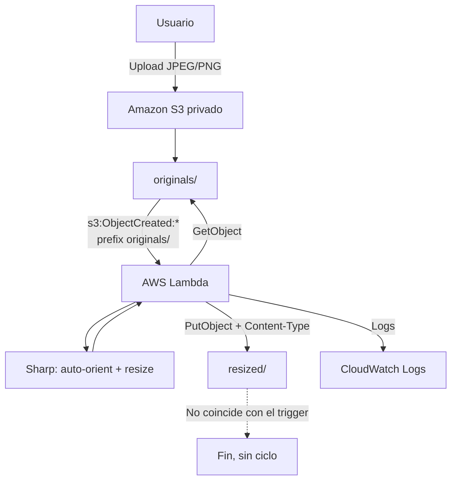

# Procesamiento automático de imágenes con arquitectura serverless en AWS

Proyecto académico completo que redimensiona automáticamente imágenes JPEG y PNG al cargarlas en Amazon S3. S3 publica un evento, AWS Lambda ejecuta código TypeScript compilado para Node.js y Sharp genera una versión ajustada dentro del mismo bucket. No se requiere invocar la función manualmente en el flujo normal.

## 1. Descripción y objetivo

El objetivo es demostrar una arquitectura serverless orientada a eventos, segura, observable e idempotente. El usuario conserva el archivo original en `originals/`; Lambda crea una copia relacionada en `resized/` sin administrar servidores.

Ejemplo:

```text
originals/foto.jpg  ->  resized/foto-resized.jpg
originals/viaje/lago.png  ->  resized/viaje/lago-resized.png
```

Las dimensiones máximas se configuran fuera del código:

```text
IMAGE_WIDTH=800
IMAGE_HEIGHT=600
```

Si faltan o contienen valores inválidos, se usan 800 × 600. Sharp aplica `fit: "inside"` para conservar la proporción y `withoutEnlargement: true` para no degradar imágenes pequeñas mediante ampliación.

## 2. Arquitectura



El diagrama ampliado y una versión textual para recrearlo en Draw.io están en [docs/architecture.md](docs/architecture.md).

## 3. Servicios y tecnologías

| Elemento | Responsabilidad |
|---|---|
| Amazon S3 | Almacena originales y resultados en un bucket privado. |
| AWS Lambda | Ejecuta el procesamiento al recibir eventos de S3. |
| IAM | Otorga a Lambda únicamente lectura de originales, escritura de resultados y logs. |
| CloudWatch Logs | Conserva logs de ejecución y errores. |
| Node.js 22.x | Runtime estable de Lambda basado en Amazon Linux 2023. |
| TypeScript | Proporciona tipado estricto y compila a JavaScript CommonJS. |
| AWS SDK for JavaScript v3 | Descarga y carga objetos mediante `GetObjectCommand` y `PutObjectCommand`. |
| Sharp | Detecta, auto-orienta y redimensiona JPEG/PNG. |
| Git/GitHub | Control de versiones y entrega del proyecto. |

> El proyecto fija versiones en `package.json` y `package-lock.json` para que la instalación sea reproducible. Aunque Lambda incluye una versión del SDK v3, se empaqueta la versión declarada por el proyecto para controlar la compatibilidad.

## 4. Estructura del proyecto

```text
serverless-image-resizer/
├── src/
│   ├── index.ts                 # Handler, lotes, logs y errores
│   ├── config.ts                # Variables de entorno y valores predeterminados
│   ├── imageProcessor.ts        # Validación y resize con Sharp
│   ├── s3Service.ts             # GetObject y PutObject con SDK v3
│   └── utils.ts                 # Keys, prefijos, extensiones y Content-Type
├── policies/
│   └── lambda-s3-policy.json    # Política IAM de mínimo privilegio
├── scripts/
│   └── package-lambda.ps1       # ZIP con binarios Linux x64 de Sharp
├── docs/
│   ├── architecture.md          # Diagramas y flujo
│   └── report-guide.md          # Estructura sugerida del PDF
├── .env.example
├── .gitignore
├── package.json
├── package-lock.json
├── tsconfig.json
└── README.md
```

## 5. Comportamiento de la función

Por cada elemento de `event.Records`, el handler:

1. Obtiene bucket y key.
2. Convierte `+` a espacio y aplica `decodeURIComponent`.
3. Ignora inmediatamente cualquier key que no comience con `originals/`; por tanto, `resized/` también se ignora defensivamente.
4. Acepta extensiones `.jpg`, `.jpeg` y `.png`, sin distinguir mayúsculas.
5. Construye una key de salida determinista.
6. Descarga el objeto con AWS SDK v3.
7. Sharp inspecciona el contenido real y rechaza archivos disfrazados con una extensión incorrecta.
8. Auto-orienta y redimensiona dentro de las dimensiones configuradas.
9. Sube el buffer conservando `image/jpeg` o `image/png`.
10. Registra resultado y continúa con el siguiente registro.

Si uno falla, se registra el detalle y se intentan los demás. Al final se lanza un `AggregateError` si hubo fallos para que la invocación no aparente éxito y AWS pueda aplicar su política de reintentos. Los resultados exitosos pueden repetirse de forma segura por la idempotencia del nombre.

## 6. Requisitos previos

- Cuenta de AWS con permiso para administrar S3, Lambda, IAM y consultar CloudWatch.
- Node.js 22 y npm 10 o posteriores.
- Git.
- PowerShell 5.1 o PowerShell 7.
- Acceso a Internet para instalar paquetes.
- Una imagen JPEG y una PNG de prueba, preferentemente mayores de 800 × 600.
- Región de ejemplo: **US East (N. Virginia) `us-east-1`**. Puede elegirse otra, pero bucket y Lambda deben estar en la misma región para el trigger directo.

No se requieren claves AWS para compilar. No coloque `AWS_ACCESS_KEY_ID`, `AWS_SECRET_ACCESS_KEY`, tokens ni contraseñas en este repositorio.

## 7. Instalación local y compilación

Abra PowerShell en la raíz del proyecto:

```powershell
npm ci
npm run check
npm run build
```

- `npm ci` instala exactamente las versiones del lockfile.
- `npm run check` valida tipos, imports, variables sin uso y opciones estrictas sin generar archivos.
- `npm run build` compila `src/*.ts` hacia `dist/*.js`.

Para desarrollo inicial, `npm install` también es válido; al existir el lockfile, `npm ci` es preferible en una instalación limpia y en automatización.

## 8. Preparación de Sharp para AWS Lambda

Sharp contiene binarios nativos. Copiar `node_modules` instalado normalmente en Windows produce binarios de Windows y Lambda no podrá cargarlos en Amazon Linux. El error típico es **Could not load the "sharp" module using the linux-x64 runtime**.

Este proyecto usa como combinación de despliegue:

- Lambda `Node.js 22.x` sobre Amazon Linux 2023.
- Arquitectura Lambda `x86_64`.
- Paquetes Sharp para `linux`, CPU `x64`, libc `glibc`.

Ejecute:

```powershell
npm run package:lambda
```

El script realiza lo siguiente:

1. Compila TypeScript.
2. Crea un área temporal `.lambda-package/`.
3. Instala solo dependencias de producción con `npm ci --omit=dev --os=linux --cpu=x64 --libc=glibc`.
4. Comprueba que existan `@img/sharp-linux-x64` y `@img/sharp-libvips-linux-x64`.
5. Comprime el **contenido** del área temporal, no la carpeta contenedora, en `umg-image-resizer.zip`.

El ZIP debe tener `index.js` y `node_modules/` en su raíz. Ambos artefactos temporales están excluidos de Git.

### Alternativas válidas

- **Docker:** ejecutar la instalación dentro de `public.ecr.aws/lambda/nodejs:22` ofrece la máxima equivalencia con el runtime. Es la alternativa recomendada si el instalador multiplataforma de npm presenta un problema en una máquina concreta.
- **Lambda Layer:** crear un ZIP `nodejs/node_modules/...` con Sharp para Linux x64, publicarlo como layer compatible con Node.js 22.x y excluir Sharp del ZIP de la función. Es útil si varias funciones comparten la misma versión.
- **Imagen de contenedor:** construir desde `public.ecr.aws/lambda/nodejs:22`, subir a ECR y crear Lambda desde esa imagen. Es ideal para artefactos grandes, pero agrega ECR y pasos que no son necesarios para esta práctica.

Si se elige `arm64`, hay que volver a empaquetar con `--cpu=arm64` y comprobar los paquetes `sharp-linux-arm64`; no mezcle binarios x64 con una función arm64.

Documentación de referencia: [instalación de Sharp para AWS Lambda](https://sharp.pixelplumbing.com/install/#aws-lambda), [runtimes Node.js de Lambda](https://docs.aws.amazon.com/lambda/latest/dg/lambda-nodejs.html) y [paquetes ZIP de Node.js](https://docs.aws.amazon.com/lambda/latest/dg/nodejs-package.html).

## 9. Creación del bucket S3 desde AWS Management Console

1. Inicie sesión y seleccione la región **US East (N. Virginia) `us-east-1`** en el selector superior derecho.
2. Vaya a **S3 → General purpose buckets → Create bucket**.
3. En **Bucket type**, conserve **General purpose**.
4. En **Bucket name**, escriba un nombre globalmente único, por ejemplo `umg-serverless-images-2026-jp01`. Reemplace el identificador por uno propio.
5. En **AWS Region**, seleccione `us-east-1`.
6. Conserve **Object Ownership: ACLs disabled (recommended)**.
7. Mantenga activado **Block all public access**. No se necesita un sitio web público.
8. Mantenga el cifrado predeterminado del servidor. Para esta práctica, **Amazon S3 managed keys (SSE-S3)** es suficiente.
9. Elija **Create bucket**.
10. Abra el bucket → **Objects → Create folder** → escriba `originals` → **Create folder**.
11. Repita para `resized`.

S3 representa carpetas como prefijos. Los objetos vacíos creados para visualizar las carpetas no son necesarios para el funcionamiento; las keys escritas por Lambda crearán visualmente `resized/` si no existe.

## 10. Política y rol IAM de mínimo privilegio

Abra [policies/lambda-s3-policy.json](policies/lambda-s3-policy.json) y sustituya todas las apariciones de `YOUR_BUCKET_NAME` por el nombre exacto del bucket. No cambie `umg-image-resizer` en los ARN de logs salvo que haya elegido otro nombre para Lambda.

La política permite únicamente:

- `s3:GetObject` en `arn:aws:s3:::YOUR_BUCKET_NAME/originals/*`.
- `s3:PutObject` en `arn:aws:s3:::YOUR_BUCKET_NAME/resized/*`.
- Crear el grupo de logs y escribir en `/aws/lambda/umg-image-resizer`.

No concede `s3:*`, acceso administrativo, borrado, listado del bucket ni acceso a otros prefijos.

### Crear la política

1. Vaya a **IAM → Policies → Create policy**.
2. Seleccione el editor **JSON**.
3. Pegue el JSON ya personalizado.
4. Elija **Next**.
5. En **Policy name**, escriba `umg-image-resizer-policy`.
6. Opcionalmente agregue una descripción y elija **Create policy**.

### Crear el rol de ejecución

1. Vaya a **IAM → Roles → Create role**.
2. En **Trusted entity type**, seleccione **AWS service**.
3. En **Use case**, seleccione **Lambda** y luego **Next**.
4. Busque y marque `umg-image-resizer-policy`; elija **Next**.
5. En **Role name**, escriba `umg-image-resizer-role`.
6. Revise la relación de confianza y el permiso, y elija **Create role**.

Lambda obtiene credenciales temporales mediante este rol. Nunca se escriben credenciales en código o variables de entorno.

## 11. Creación y configuración de AWS Lambda

1. Vaya a **Lambda → Functions → Create function**.
2. Seleccione **Author from scratch**.
3. En **Function name**, escriba `umg-image-resizer`.
4. En **Runtime**, elija **Node.js 22.x**.
5. En **Architecture**, elija **x86_64**.
6. Expanda **Change default execution role**.
7. Seleccione **Use an existing role** y elija `umg-image-resizer-role`.
8. Elija **Create function**.

### Runtime, memoria y timeout

1. En la función, vaya a **Code → Runtime settings → Edit**.
2. Confirme **Handler: `index.handler`** y guarde.
3. Vaya a **Configuration → General configuration → Edit**.
4. Configure inicialmente **Memory: 1024 MB** y **Timeout: 30 sec**.
5. Elija **Save**.

Sharp es intensivo en CPU y Lambda asigna CPU en proporción a la memoria. Para una práctica con imágenes moderadas, 1024 MB y 30 segundos son valores iniciales razonables; ajuste después de observar métricas reales. El límite del archivo de entrada debe controlarse operacionalmente si el sistema se expone a usuarios no confiables.

### Variables de entorno

1. Vaya a **Configuration → Environment variables → Edit**.
2. Elija **Add environment variable**.
3. Agregue `IMAGE_WIDTH` con valor `800`.
4. Agregue `IMAGE_HEIGHT` con valor `600`.
5. Elija **Save**.

La función lee directamente `process.env.IMAGE_WIDTH` y `process.env.IMAGE_HEIGHT`. No agregue claves de AWS.

## 12. Generación y carga del paquete

En PowerShell:

```powershell
npm ci
npm run check
npm run package:lambda
```

Luego, en la función:

1. Abra **Code**.
2. Elija **Upload from → .zip file**.
3. Seleccione `umg-image-resizer.zip`.
4. Elija **Save**.
5. Espere a que aparezca la confirmación de actualización.

Si el ZIP supera el límite de carga directa mostrado por la consola, súbalo primero a un bucket de artefactos y utilice **Upload from → Amazon S3 location**, o use AWS CLI. No suba el código TypeScript aislado: Lambda necesita JavaScript compilado y los módulos nativos Linux.

## 13. Configuración exacta del trigger S3

La forma más directa es configurarlo desde Lambda:

1. En **Lambda → Functions → umg-image-resizer**, elija **Add trigger**.
2. En **Trigger configuration**, seleccione **S3**.
3. En **Bucket**, elija el bucket creado.
4. En **Event types**, seleccione **All object create events** (`s3:ObjectCreated:*`).
5. En **Prefix**, escriba exactamente `originals/`.
6. Deje **Suffix** vacío para admitir `.jpg`, `.jpeg` y `.png` con una sola notificación.
7. Marque la casilla de reconocimiento sobre invocación recursiva después de comprobar el prefijo.
8. Elija **Add**.

La consola agrega a la política basada en recursos de Lambda el permiso para que ese bucket invoque la función. El bucket y Lambda deben estar en la misma región.

También puede comprobarlo en **S3 → General purpose buckets → [bucket] → Properties → Event notifications**. La notificación debe mostrar el prefijo `originals/`, eventos de creación y destino Lambda.

No configure el trigger sobre todo el bucket. AWS advierte que una función que escribe en el mismo bucket que la invoca puede entrar en un ciclo; el filtro por prefijo es la barrera principal. Consulte [procesamiento de eventos S3 con Lambda](https://docs.aws.amazon.com/lambda/latest/dg/with-s3.html) y [notificaciones de eventos en la consola S3](https://docs.aws.amazon.com/AmazonS3/latest/userguide/enable-event-notifications.html).

## 14. Prueba completa del sistema

Use una imagen mayor de 800 × 600 y anote sus dimensiones antes de comenzar.

1. Abra **S3 → General purpose buckets → [bucket]** y muestre `originals/` y `resized/`.
2. Entre en `resized/` y confirme su estado inicial. Elimine pruebas anteriores solo si sabe que no necesita conservarlas.
3. En su computadora, abra las propiedades o detalles de la imagen original y muestre dimensiones y formato.
4. En S3, entre en `originals/` → **Upload → Add files** → seleccione la imagen → **Upload**.
5. No pulse **Test** en Lambda: espere unos segundos; S3 debe invocarla automáticamente.
6. En Lambda, abra **Monitor → View CloudWatch logs**. Como alternativa: **CloudWatch → Log groups → `/aws/lambda/umg-image-resizer`**.
7. Abra el log stream más reciente y localice inicio, bucket, key, Content-Type, 800 × 600, descarga, procesamiento, key de salida y guardado.
8. Regrese a S3 → `resized/` y actualice la lista.
9. Compruebe `foto-resized.jpg` o el nombre correspondiente.
10. Descargue el resultado mediante **Download** y abra sus propiedades.
11. Compare dimensiones. Con `fit: inside`, una foto 1600 × 1200 se vuelve 800 × 600; una foto 1600 × 900 se vuelve 800 × 450.
12. Regrese a `originals/` y demuestre que la imagen original sigue presente e intacta.
13. Espere y vuelva a CloudWatch. Debe existir una invocación por la carga original, no una cadena continua ocasionada por el objeto de `resized/`.

Para probar PNG, repita con un archivo `.png`. En S3, abra el detalle del resultado y compruebe **Content type: `image/png`**. Para JPEG debe ser `image/jpeg`.

## 15. Logs en CloudWatch

La función registra como mínimo:

- Inicio y cantidad de registros.
- Bucket, key decodificada y tipo de evento.
- Content-Type esperado por extensión y declarado por S3.
- Dimensiones configuradas y key de salida.
- Confirmación y bytes de descarga.
- Content-Type detectado por Sharp, dimensiones de entrada/salida y bytes del resultado.
- Confirmación de `PutObject`.
- Resumen de procesados, ignorados y fallidos.
- Nombre, mensaje y stack de cualquier error.

Ruta: **CloudWatch → Logs → Log groups → `/aws/lambda/umg-image-resizer`**. Los logs no incluyen contenido de imágenes, credenciales, tokens ni secretos.

Si el grupo aún no existe, realice una carga válida y actualice CloudWatch. El rol debe tener `logs:CreateLogGroup`, `logs:CreateLogStream` y `logs:PutLogEvents`.

## 16. Prevención de ciclos

Se utilizan dos controles complementarios:

1. **Infraestructura:** el trigger solo coincide con `originals/`. `PutObject` escribe en `resized/`, por lo que no crea una nueva invocación.
2. **Código:** `isOriginalKey` termina el registro si la key no comienza con `originals/`. Un evento manual o una configuración accidental con `resized/` será ignorado.

El permiso IAM refuerza el diseño: Lambda no puede escribir sobre `originals/*` con esta política.

## 17. Idempotencia y entrega de eventos

Las notificaciones de S3 se entregan al menos una vez, por lo que un evento puede repetirse. La salida se calcula exclusivamente a partir de la entrada:

```text
originals/foto.jpg -> resized/foto-resized.jpg
```

No se usan fechas, UUID ni contadores. Una repetición escribe de nuevo la misma key con el mismo procesamiento y no crea resultados inconsistentes como `foto-resized-2.jpg`. El original nunca se sobrescribe.

En un sistema de producción que requiera evitar incluso el costo de reprocesamiento podrían almacenarse `bucket + key + eTag/versionId` en DynamoDB con una escritura condicional. No es necesario para la consistencia solicitada en esta práctica.

## 18. Seguridad

- El bucket permanece privado y con **Block all public access** activado.
- Lambda usa un IAM role; no hay secretos en el código.
- La política separa prefijos de lectura y escritura.
- No se conceden acciones administrativas, borrado ni `s3:*`.
- Sharp valida el formato binario real, no confía solamente en extensión o metadata aportada por el usuario.
- Las dimensiones se validan como enteros positivos y se limitan a 10 000 píxeles.
- Los errores no imprimen el contenido del archivo ni credenciales.
- Git ignora `.env`, claves, `node_modules`, artefactos ZIP y temporales.

Para un sistema abierto a cargas no confiables, agregar límites de tamaño, validación previa, retención, alarmas y presupuestos. Si se usa cifrado SSE-KMS con una clave administrada por el cliente, el rol necesitará permisos KMS estrictamente sobre esa clave; la política incluida asume SSE-S3.

## 19. Solución de errores frecuentes

### `Could not load the "sharp" module`

Confirme arquitectura `x86_64`, vuelva a ejecutar `npm run package:lambda` y no comprima el `node_modules` de Windows. En el área temporal deben existir `node_modules/@img/sharp-linux-x64` y `node_modules/@img/sharp-libvips-linux-x64`.

### `AccessDenied` en `GetObject`

Revise el nombre del bucket dentro de la política, que la key esté en `originals/` y que Lambda use `umg-image-resizer-role`. Si el objeto usa una clave KMS propia, revise también KMS.

### `AccessDenied` en `PutObject`

Revise el recurso `arn:aws:s3:::BUCKET/resized/*`. No agregue `s3:*`; corrija bucket/prefijo.

### No aparece la imagen en `resized/`

Compruebe el trigger, prefijo `originals/` con barra final, región, extensión, logs y handler `index.handler`. Actualice la lista de objetos.

### No aparecen logs

Confirme que hubo una invocación y que el rol contiene permisos de CloudWatch Logs. Busque exactamente `/aws/lambda/umg-image-resizer`.

### `Handler 'handler' missing` o `Cannot find module`

El handler debe ser `index.handler`; `index.js` y `node_modules/` deben quedar en la raíz del ZIP, no dentro de `dist/` ni de otra carpeta superior.

### El archivo se ignora

La key debe iniciar con `originals/` y terminar en `.jpg`, `.jpeg` o `.png`. Un archivo WebP o texto renombrado deliberadamente será ignorado o rechazado.

### Conflicto al crear la notificación S3

S3 no admite configuraciones de notificación ambiguas que se solapen para el mismo evento. Revise **Properties → Event notifications** y elimine o ajuste una notificación previa solo si pertenece a esta práctica.

### La salida no mide exactamente 800 × 600

Es correcto: `fit: inside` limita el rectángulo sin deformar. Una imagen apaisada 1600 × 900 produce 800 × 450. `withoutEnlargement` conserva el tamaño de entradas menores al límite.

## 20. Evento manual opcional para diagnóstico

El mecanismo principal siempre debe ser la carga real en S3. Si necesita aislar un problema, puede crear temporalmente un evento de prueba S3 en Lambda, con bucket y key reales. La key debe estar URL-encoded cuando contenga espacios. No use esta prueba como evidencia única de automatización.

## 21. Git y GitHub

Desde la raíz del proyecto:

```powershell
git init
git add .
git status
git commit -m "Implementar redimensionador serverless de imágenes"
git branch -M main
git remote add origin https://github.com/USUARIO/serverless-image-resizer.git
git push -u origin main
```

Antes del commit, `git status` no debe mostrar `.env`, `node_modules/`, `dist/`, `.lambda-package/`, credenciales ni `umg-image-resizer.zip`. Cree primero un repositorio vacío en GitHub y sustituya `USUARIO` y la URL. La autenticación se realiza con el método seguro configurado por Git/GitHub, nunca guardando tokens dentro del proyecto.

## 22. Todos los comandos de PowerShell

```powershell
# Entrar al proyecto (las comillas son importantes porque la ruta contiene espacios)
Set-Location "C:\Users\javie\Downloads\Procesamiento de imágenes con arquitectura serverless"

# Instalar exactamente el lockfile
npm ci

# Validar TypeScript sin emitir archivos
npm run check

# Compilar a dist/
npm run build

# Crear umg-image-resizer.zip con dependencias Linux x64
npm run package:lambda

# Revisar qué contiene la raíz del ZIP
Add-Type -AssemblyName System.IO.Compression.FileSystem
[System.IO.Compression.ZipFile]::OpenRead((Resolve-Path ".\umg-image-resizer.zip")).Entries |
    Select-Object -First 20 -ExpandProperty FullName

# Preparar el repositorio Git
git init
git add .
git status
git commit -m "Implementar redimensionador serverless de imágenes"
git branch -M main
git remote add origin https://github.com/USUARIO/serverless-image-resizer.git
git push -u origin main
```

Cada comando se ejecuta por separado. Los comandos Git de `remote` y `push` requieren haber creado el repositorio de destino y reemplazado la URL.

## 23. Evidencias requeridas para el video

Secuencia recomendada para una grabación clara:

1. Presentar brevemente el diagrama y los recursos.
2. Mostrar el bucket, `originals/` y el estado inicial de `resized/`.
3. Mostrar formato y dimensiones de la imagen local.
4. Subirla a `originals/`.
5. Esperar sin invocar Lambda manualmente.
6. Abrir CloudWatch y recorrer los logs.
7. Regresar a `resized/` y mostrar el objeto generado.
8. Descargarlo y comparar dimensiones.
9. Confirmar que el original permanece.
10. Mostrar el trigger con prefijo y la ausencia de ejecuciones en ciclo.

Evite mostrar el identificador de cuenta completo, correos, tokens u otra información sensible durante la grabación.

## 24. Evidencias requeridas para el PDF

Debajo de cada captura incluya número, título, descripción objetiva y una explicación propia. Recorte información personal o sensible.

### Captura 1: imagen original y dimensiones

Mostrar el archivo local, formato y propiedades. Explicar que constituye la entrada y anotar ancho × alto antes del procesamiento.

### Captura 2: bucket S3

Mostrar el nombre del bucket y región. Explicar que es almacenamiento de objetos privado y que el nombre es globalmente único.

### Captura 3: carpeta `originals/`

Mostrar el prefijo en la consola. Explicar que únicamente este prefijo recibe entradas que deben activar el proceso.

### Captura 4: imagen cargada en `originals/`

Mostrar key, tamaño y fecha. Explicar que la carga genera `s3:ObjectCreated:*` automáticamente.

### Captura 5: función AWS Lambda

Mostrar nombre y resumen de la función. Explicar que ejecuta el código sin administrar servidores.

### Captura 6: configuración del trigger de S3

Mostrar S3 conectado a Lambda y el tipo de evento. Explicar que **All object create events** cubre las formas de creación admitidas por S3.

### Captura 7: filtro prefix `originals/`

Enfocar el filtro con barra final. Explicar que evita invocaciones por objetos escritos en `resized/`.

### Captura 8: variables `IMAGE_WIDTH` e `IMAGE_HEIGHT`

Mostrar ambas variables y valores. Explicar que las dimensiones son configuración externa y poseen valores predeterminados en código.

### Captura 9: permisos IAM

Mostrar el rol asociado a Lambda. Explicar que la función recibe credenciales temporales mediante el rol, no mediante claves incrustadas.

### Captura 10: política IAM

Mostrar los statements y ARN personalizados. Explicar el mínimo privilegio: leer originales, escribir resultados y emitir logs, sin `s3:*`.

### Captura 11: CloudWatch mostrando ejecución exitosa

Mostrar un mismo log stream con inicio, descarga, procesamiento y guardado. Explicar cómo se correlacionan bucket, key y dimensiones sin exponer secretos.

### Captura 12: `resized/` con el resultado

Mostrar la key `*-resized.*`. Explicar el nombre determinista y su utilidad para idempotencia.

### Captura 13: imagen procesada

Abrir o previsualizar el resultado. Explicar que conserva formato y proporción visual.

### Captura 14: dimensiones originales

Mostrar nuevamente las propiedades de entrada. Explicar que son la línea base cuantitativa.

### Captura 15: dimensiones nuevas

Mostrar las propiedades del archivo descargado desde `resized/`. Explicar la relación con el límite 800 × 600 y `fit: inside`.

### Captura 16: original y procesada juntas

Colocar ambas vistas o propiedades lado a lado. Explicar la diferencia de dimensiones y demostrar que el original no fue sobrescrito.

## 25. Lista de verificación antes de entregar

- [ ] `npm ci`, `npm run check` y `npm run build` terminan sin errores.
- [ ] Lambda usa Node.js 22.x y arquitectura x86_64.
- [ ] El handler es `index.handler`.
- [ ] El ZIP incluye Sharp para Linux x64 y no el binario exclusivo de Windows.
- [ ] Bucket y Lambda están en la misma región.
- [ ] El bucket es privado y mantiene Block Public Access.
- [ ] El rol no tiene permisos administrativos ni `s3:*`.
- [ ] El trigger tiene `s3:ObjectCreated:*` y prefijo `originals/`.
- [ ] JPEG produce `image/jpeg` y PNG produce `image/png`.
- [ ] `resized/` no genera un ciclo.
- [ ] La repetición produce la misma key.
- [ ] El original permanece intacto.
- [ ] CloudWatch contiene los logs solicitados.
- [ ] GitHub no contiene credenciales, ZIP, `dist/` ni `node_modules/`.
- [ ] El PDF y video tienen permisos de visualización para el docente.

## 26. Guía del informe final

La estructura desarrollada de las 20 secciones solicitadas para el PDF está en [docs/report-guide.md](docs/report-guide.md).

## Referencias técnicas oficiales

- [AWS Lambda: runtimes de Node.js](https://docs.aws.amazon.com/lambda/latest/dg/lambda-nodejs.html)
- [AWS Lambda: procesar notificaciones de S3](https://docs.aws.amazon.com/lambda/latest/dg/with-s3.html)
- [Amazon S3: configurar notificaciones desde la consola](https://docs.aws.amazon.com/AmazonS3/latest/userguide/enable-event-notifications.html)
- [AWS Lambda: variables de entorno](https://docs.aws.amazon.com/lambda/latest/dg/configuration-envvars.html)
- [AWS Lambda: consultar logs en CloudWatch](https://docs.aws.amazon.com/lambda/latest/dg/monitoring-cloudwatchlogs-view.html)
- [Sharp: instalación y AWS Lambda](https://sharp.pixelplumbing.com/install/#aws-lambda)

Estas rutas de consola y runtimes fueron contrastadas con la documentación oficial. AWS puede ajustar etiquetas visuales menores con el tiempo; la jerarquía de servicios y los nombres de configuración indicados corresponden a la consola actual al preparar este proyecto.
