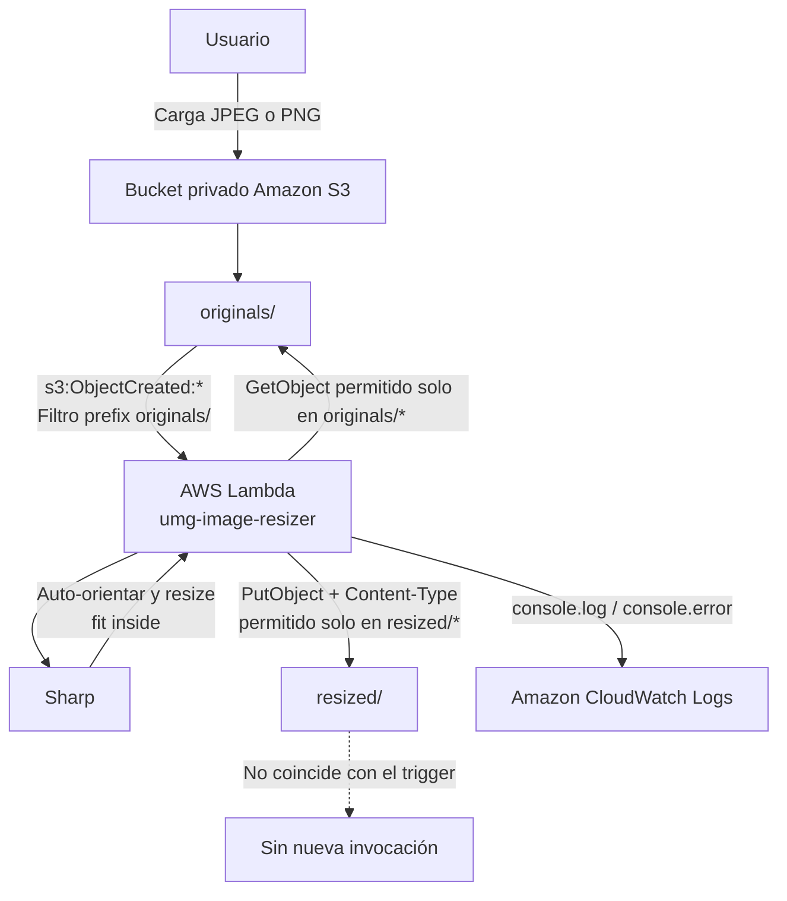

# Arquitectura del redimensionador serverless

## Diagrama Mermaid

## Flujo del evento

1. El usuario sube un archivo JPEG o PNG al prefijo `originals/` del bucket privado.
2. Amazon S3 emite `s3:ObjectCreated:*` porque la key coincide con el filtro `originals/`.
3. Lambda recibe uno o más registros, decodifica cada key y vuelve a comprobar el prefijo y la extensión.
4. Lambda descarga el objeto con `GetObject` y Sharp comprueba su formato real.
5. Sharp auto-orienta la imagen y la ajusta dentro del límite `IMAGE_WIDTH` × `IMAGE_HEIGHT`, sin deformarla ni ampliarla.
6. Lambda guarda el resultado con un nombre determinista en `resized/` y el `Content-Type` correcto.
7. La escritura en `resized/` no coincide con el filtro del trigger, por lo que el flujo termina.
8. Los mensajes de la ejecución quedan en `/aws/lambda/umg-image-resizer` en CloudWatch Logs.

## Versión textual para Draw.io

Crear los siguientes bloques de izquierda a derecha (o de arriba hacia abajo):

1. **Usuario** — icono de persona.
2. **Amazon S3 / bucket privado** — contenedor principal.
3. Dentro del bucket, dos bloques: **originals/** y **resized/**.
4. **AWS Lambda / umg-image-resizer** — bloque de cómputo.
5. **Sharp / resize fit inside** — bloque de procesamiento dentro o junto a Lambda.
6. **Amazon CloudWatch Logs** — bloque de observabilidad.

Conectar con flechas etiquetadas:

- Usuario → originals/: `Upload JPEG/PNG`.
- originals/ → Lambda: `s3:ObjectCreated:* (prefix originals/)`.
- Lambda → originals/: `GetObject`.
- Lambda → Sharp: `Buffer original`.
- Sharp → Lambda: `Buffer redimensionado`.
- Lambda → resized/: `PutObject + Content-Type`.
- Lambda → CloudWatch: `Logs`.
- resized/ → fin: `No coincide con el filtro; sin ciclo`.

Marcar en el dibujo los límites IAM: lectura únicamente sobre `originals/*` y escritura únicamente sobre `resized/*`.
